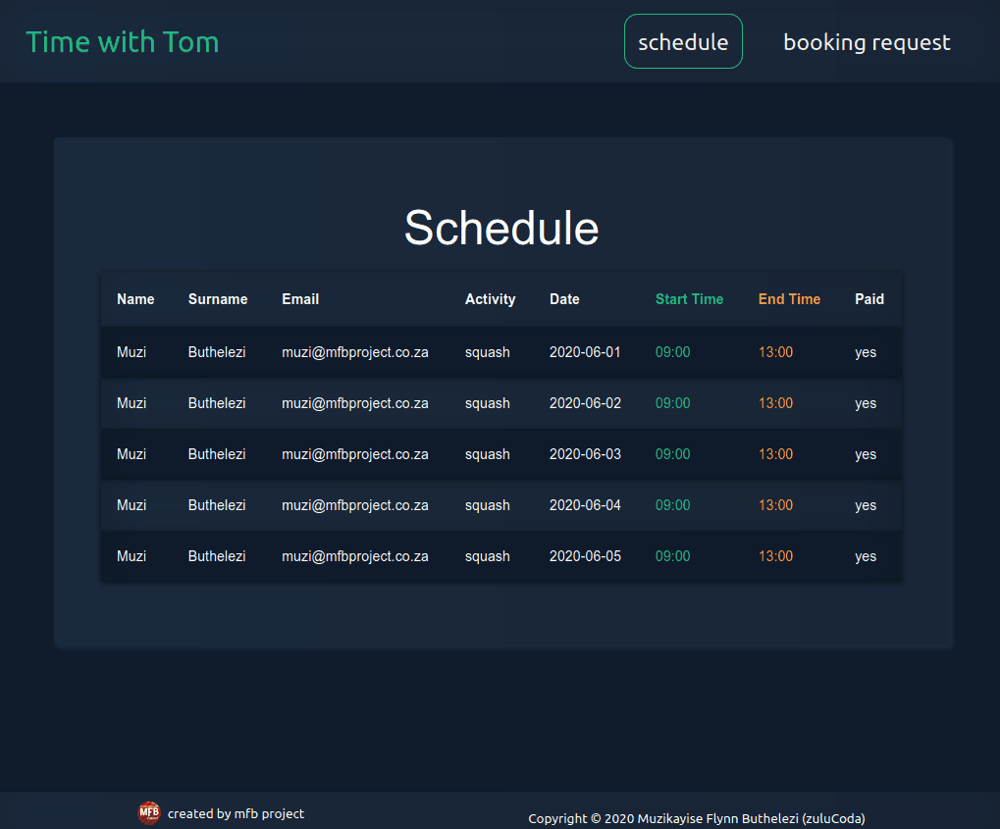

# Time with Tom
Tom is a popular guy and therefore everyone wants to book time with Tom. So I built a time booking web app for Tom. This web app allows Tom to manage all his social interaction.

1. Users can access Tom’s schedule, and they can see when Tom is available for bookings.
1. Then users can capture a booking request with the following:
* date
* time
* an activity they want to do with Tom
* name
* surname
* email

**Time with Tom uses the following:**
* React
* Formik
* React-Router
* React Material-ui

**Links**
- **Demo:** [https://time-with-tom.mfbproject.co.za/](https://time-with-tom.mfbproject.co.za)
- **Workflows blog post:** [BLOG POST LINK](BLOG POST LINK)

**Making a booking**

---------------------------------------------------------------
## Dev Process

**Future features:**
* multiple users on the booking for activities like golf
* start accepting payments for some activities

**Design - MVP**
* Users
    - name
    - surname
    - email
* Booking
    - date
    - start time
    - end time
* Activity
    - title
    - description
    - minimum time

**Design - future features**
* start accepting payments for some activities 
    - Payment Details
        * Card Provider (Visa or Master Card)
        * Credit card number
        * CVV Number 
        * Expiration Date
* multiple users on the booking for activities like golf
    - Users
        - name
        - surname
        - emai1l

**Architecture - MVP**
* make a new booking request
    - display activity - activity is the product which determines what the form should render.
    - select an activity 
    - display:
        * user details
        * booking details
        * submit button
* display current bookings
    - display all submitted booking requests.

**Architecture - future features**
* make a new booking request
    - display activity - activity is the product which determines what the form should render.
    - select an activity
    - display single user booking:
        * user details
        * booking details
        * Payment Option (for some activities)
        * submit button
    - display multiple users booking:
        * multiple users details
        * booking details
        * Payment Option
        * submit button

**Workflow**
* activity-workflow ({...options}) => 
    - component -> activity
    - payload -> values -> ()
    - validate -> values -> ()
    - initialValues

**isWorkflowActive**
Each workflow will have a field that is isWorkflowActive_workflowname = true That way the feature formik will be able to disable workflows in their business rules by deactivating or activating a workflow. Then the flow is itself will allow itself to check its own active value and this will determine whether it should proceed with rendering, validate and payload mapping.

**payment workflow**
Initially display credit card details
Later on, we may expand payment details to support more options via sub-workflows - part 2 of the blog post
